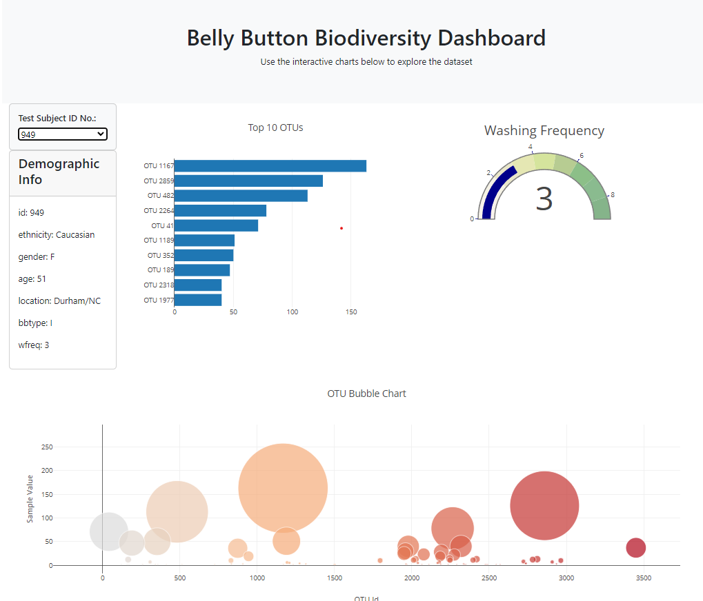

# belly-button-challenge

The purpose of this project is to build an interactive dashboard using Javascript and HTML that explores the biodiversity of a belly button dataset. The dataset catalogues the microbes in the human navels, and dataset reveals a small handful of microbial species that is present in 70% of people.

Using the D3 library, I was able to read the samples. Json file from the URL, this was easily done with const variable declared as URL. After which I then created a formula that will read in the Json file and be saved as a ‘dataPromise’. Declaring the variables to read in the data is essential to the next part which is fetching the data and console logging the data.

Function ‘optionChanged’ is created to change the sample data when it is triggered whenever the user selects a different sample ID from the dropdown menu. It’s purpose is to update the dashboard based on the selected sample ID. Each chart within the optionChanged function allows the selected sample ID taken as an argument and updates the chart accordingly. 

Function ‘displayMeta’ is created to change the demographic information panel based on the selected sample ID. The line that finds the metadata corresponds to the selected ID from an array. By selecting the html element ‘sample-metadata’ using the D3.js library, the demographic information will be displayed on the side of the page. 

The ‘dropdownMenu ‘variable allows the D3.json library to loop through the data in the sampleID parameter and append the sample ID into the text and then place them as attributes values in the ‘dropdownMenu’.

The function bar chart allows me to create a function for each sample ID that is selected in the ‘dropdownMenu’. In the first line of the function, ‘sampleData’ variable allows me to find the sampleItem id and check if the id property is equal to the sample variable if the condition evaluate true. The second line allows me to fetch the top 10 ‘otu_ids’ and maps it out as ID and reverse’s the data so it’s ascending order. The third line allows me to do something similar to the previous line except I retrieving the ‘sample_values’ instead of ‘otu_ids’. The fourth and final variable naming is similar to the previous fetching variables instead of samples values and out ids the variable is fetching the labels.

The next part after fetching the sample data, is to create a tracing data variable so that the plotly barchart takes in the values of x and y according to sample ID. The next part is creating the layout, which includes naming the chart.

After creating the bar chart, next is the bubble chart. The bubble chart has similar functions to the bar chart except this bubble chart uses markers as mode value to change the size and the color of the value. Similar trace created to call the values, the ids and the labels.

